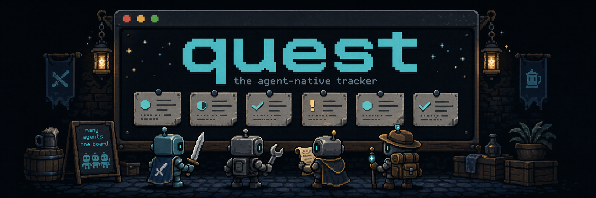

# quest

<p align="center">
  
</p>

quest is a local-first issue tracker built for coding agents. Issues are
quests: an agent claims one with `accept`, turns the fix in with a PR and a
summary, and nothing goes `complete` until that PR is merged. Dependencies are
quest chains. Every step lands in an append-only event log with evidence
attached, so the next session starts from what the last one actually did.

It runs as one compiled binary with a SQLite store on your machine — no
server, no account. A repo that needs to be shared migrates to a Convex
backend the team deploys themselves; the verbs don't change. Storage sits
behind a small adapter interface with a shared contract test suite, so adding
another backend is implementing the ports and passing the suite — SQLite and
Convex are the two that ship. The CLI is the API: every command returns a
versioned JSON envelope, and the bundled skill teaches Claude Code and Codex
the workflow.

## Install

macOS or Linux — the installer verifies checksums, writes to `~/.local/bin`,
and never uses sudo:

```sh
curl -fsSL https://raw.githubusercontent.com/janiorvalle/quest/main/install.sh | sh
```

Windows:

```powershell
irm https://raw.githubusercontent.com/janiorvalle/quest/main/install.ps1 | iex
```

Open a new terminal afterward so the updated `PATH` is visible. Upgrading
later is built in:

```sh
quest upgrade
```

Linux binaries need glibc (no Alpine/musl), and the x64 builds need an
AVX2-capable CPU. Windows arm64 isn't available yet — Bun doesn't provide that
compile target.

## Use it

File work as it comes up — quest checks for near-duplicates before writing:

```sh
quest add "Login button does nothing on the accounts page" --kind bug \
  --desc "Steps: log in, click Accounts, click Login. Expected: navigates. Actual: nothing."
```

An agent takes the next piece of work and gets its full briefing in one
command — description, chain position, prior attempts, evidence paths:

```sh
quest next --claim --brief
```

Turn work in with the receipt, and complete it after the PR merges:

```sh
quest turnin 12 --pr https://github.com/you/app/pull/47 --summary "Fixed the route guard; added 3 tests"
quest complete 12 --evidence retest.png
```

Look at the board however you want:

```sh
quest list            # table, current repo
quest show 12         # one quest, full detail
quest stats           # per-repo counts
quest events --since 2026-08-01   # the raw audit log
```

Every command takes `--format json` and returns a versioned envelope, which is
how agents consume it. Claims use leases — an agent that dies loses its claim
after a timeout instead of holding work hostage.

Running `quest` bare opens a read-only viewer: the live board in your
terminal, `j`/`k` to move, `tab` for areas, `r` to switch repos, `E` to open a
quest's evidence, `p` to open its PR, `q` to quit. It can't change anything —
doing happens through the verbs.

## Agents

The CLI is the API. The bundled skill (`.agents/skills/quest/`) teaches Claude
Code and Codex the verbs, the lifecycle rules, and the evidence expectations —
point your agent at it and the board becomes shared memory across sessions.
Events record which guild, model, and effort level touched each quest, so
`quest brief` can tell attempt two exactly what attempt one was and did.

There's also a dispatcher (`scripts/dispatch.ts`) that walks the ready queue
and spawns real worker agents in isolated git worktrees, on your existing
Claude or Codex login. It only runs when you run it:

```sh
bun scripts/dispatch.ts --agent claude --trust full --concurrency 2
```

## Teams

The team backend is Convex, and you deploy it yourself — quest ships the
functions, nobody else's infrastructure is involved. See
[docs/DEPLOY.md](docs/DEPLOY.md) for the walkthrough. Onboarding a teammate is
two steps: they install quest, then run `quest join <deployment-url>` with a
one-time invite token. Their personal key is written straight into their
config and never travels through chat.

Moving a repo to the team backend (or back) is one command, with backups on
both sides and verified counts before anything routes:

```sh
quest migrate my-repo --to convex --deployment https://your-team.convex.cloud
quest migrate my-repo --to sqlite   # reverse, same guarantees
```

`quest backup run` mirrors the store, evidence, and config locally on every
write; `quest doctor` checks the whole setup when something feels off.

## Docs

| File | Contents |
|---|---|
| [VISION.md](VISION.md) | What this is and deliberately is not |
| [docs/CLI.md](docs/CLI.md) | Full verb surface, repo scoping, JSON envelope |
| [docs/DATA-MODEL.md](docs/DATA-MODEL.md) | Schema: quests, evidence, chains, statuses, verdicts |
| [docs/DEPLOY.md](docs/DEPLOY.md) | Self-host the Convex backend and bootstrap admin access |
| [docs/ARCHITECTURE.md](docs/ARCHITECTURE.md) | Layers, ports, domain purity — the backend-swap insurance |
| [docs/TECH-STACK.md](docs/TECH-STACK.md) | Runtime, storage, libraries, and platform support |
| [docs/BACKUP.md](docs/BACKUP.md) | Backup, verify, and restore |

## Development

[CONTRIBUTING.md](CONTRIBUTING.md) has setup, the test policy, and the store
adapter guide. [SECURITY.md](SECURITY.md) has the disclosure process and the
local trust model.

## License

MIT. See [LICENSE](LICENSE).
